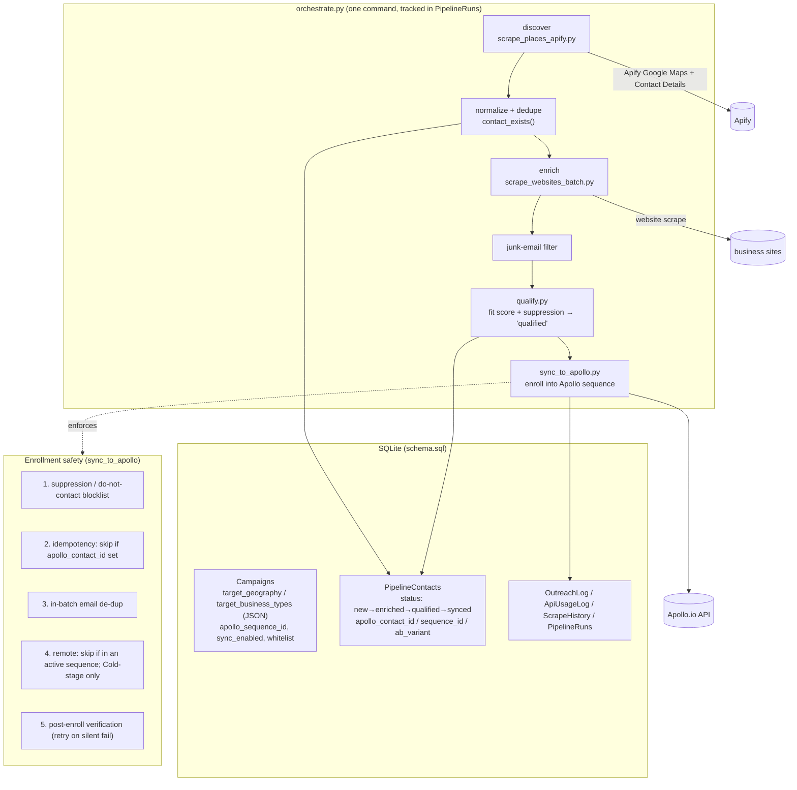

# Conduit — Architecture

Conduit is a self-contained, SQLite-backed pipeline that discovers local businesses, enriches their
contact details, qualifies them, and enrolls the qualified ones into an Apollo.io email sequence — with
suppression, idempotency, dry-run, and full audit logging throughout.

## Data model (canonical)
One schema, `schema.sql`, is the single source of truth. Geography and business-type targeting are JSON
arrays on the campaign (`target_geography`, `target_business_types`). Contact status flows
`new → enriched → qualified → synced`, with `disqualified` / `do_not_contact` / `opted_out` terminal states.

## Apollo integration (`apollo_client.py` + `sync_to_apollo.py`)
- Auth from `APOLLO_API_KEY`; base URL and custom-field IDs from the environment (no tenant IDs hardcoded).
- Sequence chosen **by ID** from `Campaigns.apollo_sequence_id`, gated by `sync_enabled` and an optional
  `whitelisted_sequences` allowlist.
- Enrollment via `POST /emailer_campaigns/{id}/add_contact_ids`, with 429/`Retry-After` handling,
  exponential backoff, per-request spacing, and a `max_batch_size` cap.
- **Dry-run by default** — live enrollment requires `--sync-live`.

## Mocked vs live
The test suite and the seeded demo run entirely offline (mocked Apollo, synthetic fixtures). Live
discovery needs `APIFY_TOKEN`; live enrollment needs `APOLLO_API_KEY` **and** `--sync-live`.
